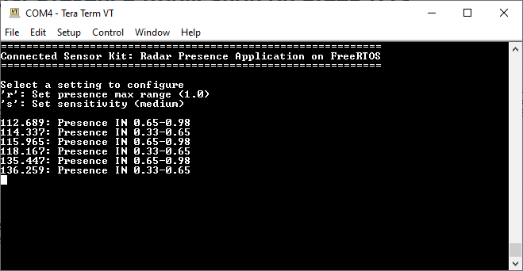

# Connected Sensor Kit: Radar Presence Application on FreeRTOS

## Overview

This code example demonstrates Infineon's radar presence solution to detect human presence within a configurable distance. Powered by the [XENSIV™ 60-GHz radar](https://www.infineon.com/cms/en/product/sensor/radar-sensors/radar-sensors-for-iot/60ghz-radar/), this solution provides extremely high accuracy in detecting both micro and macro motions. The ability to detect micro motion offers unique benefits over conventional technologies deployed to detect human presence, thus making it perfect for user interaction with devices.

## Features

- Ability to detect both micro and macro motions

- Configurable parameters (maximum range, sensitivity) via terminal UI

- Immunity from environmental factors such as temperature, wind, sunlight, and dust/debris

## Requirements

- [ModusToolbox&trade; software](https://www.cypress.com/products/modustoolbox-software-environment) v2.2

    **Note:** This code example version requires ModusToolbox software version 2.2 or later and is not backward compatible with v2.1 or older versions.
- Board Support Package (BSP) minimum required version: 2.0.0
- Programming Language: C
- Associated Parts: All [PSoC&trade; 6 MCU](http://www.cypress.com/PSoC6) parts

## Supported Toolchains (make variable 'TOOLCHAIN')

- GNU Arm® Embedded Compiler v9.3.1 (`GCC_ARM`) - Default value of `TOOLCHAIN`

## Supported Kits (make variable 'TARGET')

- Rapid IoT Connect Developer Kit (`CYSBSYSKIT-DEV-01`) - Default value of `TARGET`

## Hardware Setup

This code example requires the XENSIV™ BGT60TR13C Radar Wing Board as part of the Connected Sensor Kit.

1. Connect the Radar Wing Board to the CYSBSYSKIT-DEV-01 kit through the pin headers.

2. Connect the CYSBSYSKIT-DEV-01 kit to the PC with the USB cable.

3. Place the CYSBSYSKIT-DEV-01 kit at a fixed location (for example, the corner of a room) to ensure optimal performance of the presence detection application.

## Software Setup

Install a terminal emulator if you don't have one. Instructions in this document use [Tera Term](https://ttssh2.osdn.jp/index.html.en).

This example requires no additional software or tools.

## Using the Code Example

Create the project and open it using one of the following:

<details><summary><b>In Eclipse IDE for ModusToolbox</b></summary>

1. Click the **New Application** link in the **Quick Panel** (or, use **File** > **New** > **ModusToolbox Application**). This launches the [Project Creator](http://www.cypress.com/ModusToolboxProjectCreator) tool.

2. Select the **CYSBSYSKIT-DEV-01** kit shown in the **Project Creator - Choose Board Support Package (BSP)** dialog.

3. In the **Project Creator - Select Application** dialog, choose the "Radar_Presence_Application_on_FreeRTOS" example by enabling the checkbox.

4. Optionally, change the suggested **New Application Name**.

5. Enter the local path in the **Application(s) Root Path** field to indicate where the application needs to be created.

   Applications that can share libraries can be placed in the same root path.

6. Click **Create** to complete the application creation process.

For more details, see the [Eclipse IDE for ModusToolbox User Guide](https://www.cypress.com/MTBEclipseIDEUserGuide) (locally available at *{ModusToolbox install directory}/ide_{version}/docs/mt_ide_user_guide.pdf*).

</details>

<details><summary><b>In Command-line Interface (CLI)</b></summary>

ModusToolbox provides the Project Creator as both a GUI tool and a command line tool to easily create one or more ModusToolbox applications. See the "Project Creator Tools" section of the [ModusToolbox User Guide](https://www.cypress.com/ModusToolboxUserGuide) for more details.

Alternatively, you can manually create the application using the following steps:

1. Download and unzip this repository onto your local machine, or clone the repository.

2. Open a CLI terminal and navigate to the application folder.

   On Linux and macOS, you can use any terminal application. On Windows, open the **modus-shell** app from the Start menu.

    **Note:** The cloned application contains a default BSP file (*TARGET_xxx.mtb*) in the *deps* folder. Use the [Library Manager](https://www.cypress.com/ModusToolboxLibraryManager) (`make modlibs` command) to select and download a different BSP file, if required. If the selected kit does not have the required resources or is not [supported](#supported-kits-make-variable-target), the application may not work.

3. Import the required libraries by executing the `make getlibs` command.

   Various CLI tools include a `-h` option that prints help information to the terminal screen about that tool. For more details, see the [ModusToolbox User Guide](https://www.cypress.com/ModusToolboxUserGuide) (locally available at *{ModusToolbox install directory}/docs_{version}/mtb_user_guide.pdf*).

</details>

<details><summary><b>In Third-party IDEs</b></summary>

1. Follow the instructions from the **In Command-line Interface (CLI)** section to create the application, and import the libraries using the `make getlibs` command.

2. Export the application to a supported IDE using the `make <ide>` command.

   For a list of supported IDEs and more details, see the "Exporting to IDEs" section of the [ModusToolbox User Guide](https://www.cypress.com/ModusToolboxUserGuide) (locally available at *{ModusToolbox install directory}/docs_{version}/mtb_user_guide.pdf*.

3. Follow the instructions displayed in the terminal to create or import the application as an IDE project.

</details>

## Operation

1. Connect the CYSBSYSKIT-DEV-01 kit with the Radar Wing Board to the PC.

2. Open a terminal program and select the KitProg3 COM port. Set the serial port parameters to 8N1 and 115200 baud.

3. Program the board using one of the following:

    <details><summary><b>Using Eclipse IDE for ModusToolbox</b></summary>

    1. Select the application project in the Project Explorer.

    2. In the **Quick Panel**, scroll down, and click **\<Application Name> Program (KitProg3_MiniProg4)**.
    </details>

    <details><summary><b>Using CLI</b></summary>

    From the terminal, execute the `make program` command to build and program the application using the default toolchain to the default target. You can specify a target and toolchain manually:

    ```
    make program TARGET=<BSP> TOOLCHAIN=<toolchain>
    ```

    Example:

    ```
    make program TARGET=CYSBSYSKIT-DEV-01 TOOLCHAIN=GCC_ARM
    ```

    </details>

4. After programming, the application starts automatically. Confirm that "Connected Sensor Kit: Radar Presence Application on FreeRTOS" along with a list of configurable parameters is displayed on the UART terminal. The parameters can be configured by pressing appropriate keys as displayed on the terminal. For details, see the [RadarSensing Library API documentation](https://github.com/cypresssemiconductorco/xensiv-radar-sensing).

   **Figure 1. Terminal Output on Program Startup**

   

    When the radar detects a target, the presence information is provided through prints on the terminal as well as an onboard LED glowing red. Additionally, the distance of the target (in meters) is also displayed along with the elapsed system time (in milliseconds).

### Radar Presence Application on FreeRTOS Configurable Parameters

- Presence range max
  - The maximum range up to which the radar detects a target
  - Supported values: 0.66-10.2 m. Default value: 2 m

- Sensitivity
  - Radar sensitivity for presence detection
  - Supported values: "high", "medium", "low". Default value: "medium"

For details, see the [RadarSensing Library API documentation](https://github.com/cypresssemiconductorco/xensiv-radar-sensing).

## Debugging

You can debug the example to step through the code. In the IDE, use the **\<Application Name> Debug (KitProg3_MiniProg4)** configuration in the **Quick Panel**. For more details, see the "Program and Debug" section in the [Eclipse IDE for ModusToolbox User Guide](https://www.cypress.com/MTBEclipseIDEUserGuide).

**Note:** **(Only while debugging)** On the CM4 CPU, some code in `main()` may execute before the debugger halts at the beginning of `main()`. This means that some code executes twice - once before the debugger stops execution, and again after the debugger resets the program counter to the beginning of `main()`. See [KBA231071](https://community.cypress.com/docs/DOC-21143) to learn about this and for the workaround.

## Design and Implementation

### Resources and Settings

**Table 1. Application Source Files**

|**File Name**            |**Comments**         |
| ------------------------|-------------------- |
| *main.c* |Has the application entry function. It sets up the board support package, global interrupts, and UART, and then initializes the controller tasks.|
| *radar_task.c* |Initializes the LEDs and has the task entry function for presence application, as well as the call back function|
| *radar_terminal_ui.c* |Has the task entry function for a simple version of the terminal UI configuration |

<br>

**Table 2. Functions in *main.c***

| **Function Name** | **Functionality** |
| ------------------------|-------------------- |
| `main` | This is the main function for the CM4 CPU. It does the following:<br>1. Initializes the BSP<br>2. Enables global interrupts<br>3. Initializes Retarget IO<br>4. Creates the radar presence task and terminal configuration task<br>6. Starts the scheduler

<br>

**Table 3. Functions in *radar_task.c***

| **Function Name** | **Functionality** |
| ------------------------|-------------------- |
| `radar_task` | Initializes the RadarSensing module and LEDs, and starts the loop of processing |
| `radar_sensing_callback` | Callback function for RadarSensing processing |
| `radar_presence_task_set_mute` | Enables/disables terminal output from the radar task |

<br>

**Table 4. Functions in *radar_terminal_ui.c***

| **Function Name** | **Functionality** |
| ------------------------|-------------------- |
| `radar_presence_terminal_ui` | Starts the terminal UI task loop |
| `terminal_ui_menu` | Prints the menu for parameter configuration |
| `terminal_ui_readline` | Gets the user input from the terminal |
| `terminal_ui_print_result` | Prints out the action result of the parameter configuration |
| `terminal_ui_info` | Prints the help information |

<br>

**Table 5. Application Resources**

| Resource  |  Alias/Object     |    Purpose     |
| :-------- | :-------------    | :------------- |
| UART (HAL) | cy_retarget_io_uart_obj | UART HAL object used by Retarget IO for Debug UART port |
| GPIO (HAL) | LED_RGB_RED      | LED to indicate presence |
| GPIO (HAL) | LED_RGB_GREEN    | LED to indicate absence |
| SPI | mSPI | Communication with radar hardware |

The application uses a UART resource from the [Hardware Abstraction Layer](https://github.com/cypresssemiconductorco/psoc6hal) (HAL) to print messages in a UART terminal emulator. The UART resource initialization and retargeting of standard I/O to the UART port is done using the [retarget-io](https://github.com/cypresssemiconductorco/retarget-io) library. After using `cy_retarget_io_init`, messages can be printed on the terminal by simply using `printf` commands.

The LEDs on the Radar Wing Board are used to show the presence and absence information.

In the terminal task, `cyhal_uart_getc`, `cyhal_uart_putc`, and `printf` are used to display a textual menu to the user, get the user input, and display feedback.

In the radar task, the SPI bus is used for communication with the radar hardware.

## Related Resources

| Application Notes                                            |                                                              |
| :----------------------------------------------------------- | :----------------------------------------------------------- |
| [AN228571](https://www.cypress.com/AN228571) – Getting Started with PSoC 6 MCU on ModusToolbox | Describes PSoC 6 MCU devices and how to build your first application with ModusToolbox |
| **Code Examples**                                            |                                                              |
| [Using ModusToolbox](https://github.com/cypresssemiconductorco/Code-Examples-for-ModusToolbox-Software) |                                                              |
| **Device Documentation**                                     |                                                              |
| [PSoC 6 MCU Datasheets](https://www.cypress.com/search/all?f[0]=meta_type%3Atechnical_documents&f[1]=resource_meta_type%3A575&f[2]=field_related_products%3A114026) | [PSoC 6 Technical Reference Manuals](https://www.cypress.com/search/all/PSoC%206%20Technical%20Reference%20Manual?f[0]=meta_type%3Atechnical_documents&f[1]=resource_meta_type%3A583) |
| **Development Kits**                                         |
| [Connected Sensor Kit](https://www.infineon.com/connectedsensorkit) | CYSBSYSKIT-DEV-01 Rapid IoT Connect Developer Kit |
| **Libraries**                                                |                                                              |
| PSoC 6 Peripheral Driver Library (PDL) and docs  | [mtb-pdl-cat1](https://github.com/cypresssemiconductorco/mtb-pdl-cat1) on GitHub |
| Cypress Hardware Abstraction Layer (HAL) Library and docs    | [mtb-hal-cat1](https://github.com/cypresssemiconductorco/mtb-hal-cat1) on GitHub |
| Retarget IO - A utility library to retarget the standard input/output (STDIO) messages to a UART port | [retarget-io](https://github.com/cypresssemiconductorco/retarget-io) on GitHub
| RadarSensing Library API - A library to detect presence and count people using XENSIV™ BGT60TR13C | [xensiv-radar-sensing](https://github.com/cypresssemiconductorco/xensiv-radar-sensing) on GitHub |
| **Middleware**                                               |                                                              |
| Links to all PSoC 6 MCU Middleware                           | [psoc6-middleware](https://github.com/cypresssemiconductorco/psoc6-middleware) on GitHub |
| **Tools**                                                    |                                                              |
| [Eclipse IDE for ModusToolbox](https://www.cypress.com/modustoolbox) | The cross-platform, Eclipse-based IDE for IoT designers that supports application configuration and development targeting converged MCU and wireless systems. |

## Other Resources

Cypress provides a wealth of data at www.cypress.com to help you select the right device, and quickly and effectively integrate it into your design.

For PSoC 6 MCU devices, see [How to Design with PSoC 6 MCU - KBA223067](https://community.cypress.com/docs/DOC-14644) in the Cypress community.

## Document History

Document Title: *CE232624* - *Connected Sensor Kit: Radar Presence Application on FreeRTOS*

| Version | Description of Change |
| ------- | --------------------- |
| 0.5.0   | New code example      |
------

All other trademarks or registered trademarks referenced herein are the property of their respective owners.


-------------------------------------------------------------------------------

© Cypress Semiconductor Corporation (An Infineon Technologies Company), 2021. This document is the property of Cypress Semiconductor Corporation and its affiliates ("Cypress"). This document, including any software or firmware included or referenced in this document ("Software"), is owned by Cypress under the intellectual property laws and treaties of the United States and other countries worldwide. Cypress reserves all rights under such laws and treaties and does not, except as specifically stated in this paragraph, grant any license under its patents, copyrights, trademarks, or other intellectual property rights. If the Software is not accompanied by a license agreement and you do not otherwise have a written agreement with Cypress governing the use of the Software, then Cypress hereby grants you a personal, non-exclusive, nontransferable license (without the right to sublicense) (1) under its copyright rights in the Software (a) for Software provided in source code form, to modify and reproduce the Software solely for use with Cypress hardware products, only internally within your organization, and (b) to distribute the Software in binary code form externally to end users (either directly or indirectly through resellers and distributors), solely for use on Cypress hardware product units, and (2) under those claims of Cypress's patents that are infringed by the Software (as provided by Cypress, unmodified) to make, use, distribute, and import the Software solely for use with Cypress hardware products. Any other use, reproduction, modification, translation, or compilation of the Software is prohibited.<br />
TO THE EXTENT PERMITTED BY APPLICABLE LAW, CYPRESS MAKES NO WARRANTY OF ANY KIND, EXPRESS OR IMPLIED, WITH REGARD TO THIS DOCUMENT OR ANY SOFTWARE OR ACCOMPANYING HARDWARE, INCLUDING, BUT NOT LIMITED TO, THE IMPLIED WARRANTIES OF MERCHANTABILITY AND FITNESS FOR A PARTICULAR PURPOSE. No computing device can be absolutely secure. Therefore, despite security measures implemented in Cypress hardware or software products, Cypress shall have no liability arising out of any security breach, such as unauthorized access to or use of a Cypress product. CYPRESS DOES NOT REPRESENT, WARRANT, OR GUARANTEE THAT CYPRESS PRODUCTS, OR SYSTEMS CREATED USING CYPRESS PRODUCTS, WILL BE FREE FROM CORRUPTION, ATTACK, VIRUSES, INTERFERENCE, HACKING, DATA LOSS OR THEFT, OR OTHER SECURITY INTRUSION (collectively, "Security Breach"). Cypress disclaims any liability relating to any Security Breach, and you shall and hereby do release Cypress from any claim, damage, or other liability arising from any Security Breach. In addition, the products described in these materials may contain design defects or errors known as errata which may cause the product to deviate from published specifications. To the extent permitted by applicable law, Cypress reserves the right to make changes to this document without further notice. Cypress does not assume any liability arising out of the application or use of any product or circuit described in this document. Any information provided in this document, including any sample design information or programming code, is provided only for reference purposes. It is the responsibility of the user of this document to properly design, program, and test the functionality and safety of any application made of this information and any resulting product. "High-Risk Device" means any device or system whose failure could cause personal injury, death, or property damage. Examples of High-Risk Devices are weapons, nuclear installations, surgical implants, and other medical devices. "Critical Component" means any component of a High-Risk Device whose failure to perform can be reasonably expected to cause, directly or indirectly, the failure of the High-Risk Device, or to affect its safety or effectiveness. Cypress is not liable, in whole or in part, and you shall and hereby do release Cypress from any claim, damage, or other liability arising from any use of a Cypress product as a Critical Component in a High-Risk Device. You shall indemnify and hold Cypress, its directors, officers, employees, agents, affiliates, distributors, and assigns harmless from and against all claims, costs, damages, and expenses, arising out of any claim, including claims for product liability, personal injury or death, or property damage arising from any use of a Cypress product as a Critical Component in a High-Risk Device. Cypress products are not intended or authorized for use as a Critical Component in any High-Risk Device except to the limited extent that (i) Cypress's published data sheet for the product explicitly states Cypress has qualified the product for use in a specific High-Risk Device, or (ii) Cypress has given you advance written authorization to use the product as a Critical Component in the specific High-Risk Device and you have signed a separate indemnification agreement.<br />
Cypress, the Cypress logo, Spansion, the Spansion logo, and combinations thereof, WICED, PSoC, CapSense, EZ-USB, F-RAM, and Traveo are trademarks or registered trademarks of Cypress in the United States and other countries. For a more complete list of Cypress trademarks, visit cypress.com. Other names and brands may be claimed as property of their respective owners.
